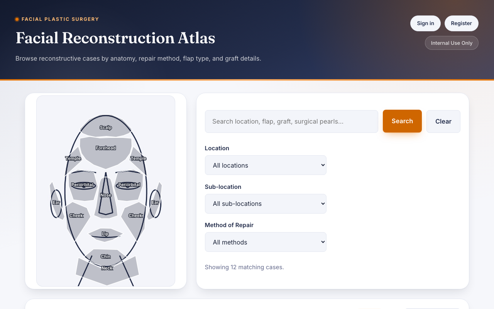
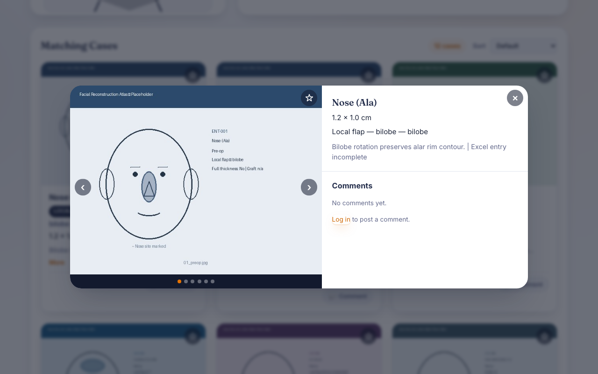

# Facial Reconstruction Atlas


A searchable, filterable reference application for facial plastic surgery reconstructive
cases. Clinicians browse a case series by anatomic defect location, repair method, and
flap or graft characteristics, with each case linking to a staged photographic series
documenting the reconstruction from pre-operative through healed.

Built as a research tool for the UVA Health Department of Otolaryngology.

**[Live demo →](https://facial-reconstruction-atlas.vercel.app)** (seeded with the 12
fabricated cases described below — nothing real)

> **This is a public, code-only copy.**
> No real case data, patient imagery, or institutional configuration is included here.
> The repository ships with a small set of **fabricated** sample cases so the
> application runs end to end out of the box. See [Sample data](#sample-data).

## Technical overview for hosting evaluation

Infrastructure and security reviewers start here:
**[docs/TECHNICAL_OVERVIEW.md](docs/TECHNICAL_OVERVIEW.md)**
([PDF](docs/Facial_Reconstruction_Atlas_Technical_Overview.pdf)) is the document prepared
for UVA Health Information Technology, dated 5 September 2026. It covers the software
stack and third-party packages, code size and repository structure, the database schema
with a SQL Server migration assessment, how image paths are stored and resolved, the data
elements displayed and their PHI and consent constraints, expected user population and
load, and the security controls both implemented and still open.

This repository is the code that document describes. It carries fabricated sample data
and no path to any departmental file share, so it can be cloned, stood up, and exercised
end to end without real data being involved in a first deployment.

## Screenshots

| Anatomy explorer | Case detail |
| --- | --- |
|  |  |

## Contents

- [Technical overview for hosting evaluation](#technical-overview-for-hosting-evaluation)
- [Features](#features)
- [Tech stack](#tech-stack)
- [Architecture](#architecture)
- [Project structure](#project-structure)
- [Getting started](#getting-started)
- [Deployment](#deployment)
- [Sample data](#sample-data)
- [How the case log is parsed](#how-the-case-log-is-parsed)
- [Image naming](#image-naming)
- [Anatomy diagrams and the region editor](#anatomy-diagrams-and-the-region-editor)
- [API reference](#api-reference)
- [Tests](#tests)
- [Security](#security)
- [License](#license)

## Features

- **Multi-criteria filtering** across defect region, sub-location, defect size,
  full-thickness status, repair method, flap type, graft type, and donor site.
- **Interactive anatomic region selector** — clickable face diagram with drill-down
  sub-diagrams for the nose, periorbital region, and lip.
- **Free-text search** spanning every case field, including surgical notes.
- **Staged photo series** per case (pre-op, defect, flap drawn, flap raised, flap
  closed, healed), served through a validated proxy rather than direct storage URLs.
- **Accounts, favorites, and comments** so reviewers can bookmark cases and leave
  clinical notes.
- **Spreadsheet validation tool** that pre-checks a case log before import.

## Tech stack

| Layer | Choice | Notes |
| --- | --- | --- |
| Backend | [FastAPI](https://fastapi.tiangolo.com/) on Python 3.12+ | Single `app.py`, no ORM |
| Database | SQLite | Rebuilt from the spreadsheet at build time, opened read-only at runtime on Vercel |
| Frontend | Vanilla HTML/CSS/JS | One `index.html` + `script.js`, no framework, no build step |
| Spreadsheet parsing | [openpyxl](https://openpyxl.readthedocs.io/) | `import_patient_log.py` |
| Placeholder imagery | [Pillow](https://python-pillow.org/) | Draws case thumbnails and the face-reference illustration |
| Auth | PBKDF2-HMAC-SHA256 + cookie sessions | No third-party auth dependency |
| Hosting | [Vercel](https://vercel.com/) (Python serverless runtime) | Auto-deploys on push via the GitHub integration |

There's no test suite yet — `validate_spreadsheet.py` is the closest thing, acting as a
data-quality gate for anything going into the database.

## Architecture

```
Browser (vanilla JS SPA)
      │  HTTPS
      ▼
FastAPI application server ──▶ SQLite      (case metadata)
                           └─▶ image store (staged photography)
```

The application server is the only path to case media. Images are never exposed as
direct file URLs — every request passes through `/api/image/...`, which validates the
path against a fixed root and an extension allowlist before streaming bytes. That
single chokepoint is what makes per-user authorization and access logging attachable as
one layer rather than a re-architecture.

**Build-time vs. runtime** is the other load-bearing split. Vercel's Python runtime is
read-only once deployed, so the SQLite database can't be written to on every cold start.
Instead:

```
patient_log.xlsx ──▶ import_patient_log.py ──▶ build.py ──▶ metadata.db, mock_o_drive/
   (build time only, via generate_placeholders.py + init_database())
```

`build.py` runs once per deploy (see [Deployment](#deployment)), sets
`ENTDATABASE_ALLOW_DB_WRITES=1` for that process only, generates the placeholder
imagery, and seeds `metadata.db`. At request time, `database_writes_allowed()`
(`app.py`) checks the Vercel-provided `VERCEL` environment variable and opens SQLite in
immutable, read-only mode unless writes are explicitly re-enabled — so a stray write
attempt against the read-only deployment bundle fails loudly instead of silently
targeting a throwaway filesystem.

That still leaves one case: a deployment that *does* re-enable writes but points
`ENTDATABASE_DB_PATH` somewhere that turns out not to be writable after all (a
misconfigured volume, a permissions mismatch). `init_database()` treats that as
recoverable rather than fatal — on a fresh path it first tries to copy the
build-produced `metadata.db` into place (`_bootstrap_db_if_needed()`, avoiding a full
spreadsheet re-import on every cold start), and if the write attempt fails with a
read-only or permissions error either way, it logs a warning, flips the app into
read-only mode for the rest of that process, and continues serving reads instead of
taking the whole app down. Startup failing shouldn't mean the login page 500s.

## Project structure

| File | Role |
| --- | --- |
| `app.py` | FastAPI application: API, auth, media proxy, anatomy definitions |
| `import_patient_log.py` | Reads the Excel case log into structured seed records |
| `image_enumeration.py` | Reads each case folder to find the photographs actually present, and their stages |
| `label_image.py` | Records a stage or ordering correction for one photograph, from the host shell |
| `validate_spreadsheet.py` | Read-only pre-flight check on a candidate case log |
| `inspect_image_share.py` | Read-only survey of a real image share — reports its file naming convention and the exceptions to it |
| `field_options.py` | Filter dropdown vocabularies |
| `generate_placeholders.py` | Generates stand-in case images and the face reference illustration |
| `build.py` | Deployment build step (images + database) |
| `create_account.py` | Creates local accounts and grants the administrator role, from the host shell |
| `tests/` | pytest suite covering the auth controls and image-path containment |
| `region-editor.html` | Visual editor for authoring the anatomy diagram polygons |
| `index.html` / `script.js` / `styles.css` | Single-page frontend |

## Getting started

Requires Python 3.12+.

```bash
python3 -m venv .venv && source .venv/bin/activate
pip install -r requirements.txt

# Use the bundled fabricated sample data
cp sample_data/patient_log.xlsx .

python generate_placeholders.py
python -c "from app import init_database; init_database()"

# Self-service registration is off by default, so make yourself an account
python create_account.py yourname

uvicorn app:app --reload --host 127.0.0.1 --port 8001
```

Open <http://127.0.0.1:8001> and sign in with the account you just created.

`create_account.py` prompts for the password rather than taking it as an argument, so
it stays out of shell history. `python create_account.py --list` shows what exists and
which accounts are administrators.

There are two kinds of account. An **administrator** may edit the case record — reorder
and relabel a case's photographs; an ordinary account only reads. Nobody is an
administrator unless named as one, including on an upgrade, where every existing account
defaults to reader:

```bash
python create_account.py curator --admin
python create_account.py --promote yourname
python create_account.py --demote yourname
``` If
you would rather have the Register button back for local work, set
`ENTDATABASE_OPEN_REGISTRATION=1` instead — see [Security](#security) for why it is off
by default.

## Deployment

The [live demo](https://facial-reconstruction-atlas.vercel.app) runs on Vercel's Python
serverless runtime, configured entirely by two files:

- **`vercel.json`** registers `app.py` as the function Vercel builds and routes all
  traffic to.
- **`pyproject.toml`**'s `[tool.vercel.scripts]` block points Vercel's build step at
  `build.py`, which stages the fabricated sample spreadsheet (mirroring the `cp
  sample_data/patient_log.xlsx .` step above), runs `generate_placeholders.py`, and
  seeds `metadata.db` — all before the function ever serves a request.

To deploy your own copy: import this repository into Vercel (or run `vercel --prod`
from a clone) — no environment variables are required for the demo data to work. Once
connected, `git push` to the default branch triggers a rebuild and redeploy
automatically.

Relevant environment variables, all optional:

| Variable | Set by | Default | Purpose |
| --- | --- | --- | --- |
| `ENTDATABASE_DB_PATH` | You | `metadata.db` beside `app.py` | Absolute or relative path to the SQLite database file |
| `ENTDATABASE_IMAGE_ROOT` | You | `mock_o_drive/` beside `app.py` | Directory the case images are served from. Resolved to an absolute path once at import; `/api/image/...` refuses to serve anything outside it |
| `ENTDATABASE_ALLOWED_ORIGINS` | You | `http://127.0.0.1:8001,http://localhost:8001` | Comma-separated CORS origin allowlist. Credentials are allowed, so this must stay an explicit list — never `*` |
| `ENTDATABASE_OPEN_REGISTRATION` | You | unset | Set to `1` to allow self-service account creation via `POST /api/auth/register`. Unset, that route returns 404 and accounts are made with `create_account.py` |
| `ENTDATABASE_SESSION_TTL_HOURS` | You | `12` | How long a session stays valid server-side, and how long the cookie is set for. A value that is not a positive whole number stops the app at startup rather than falling back |
| `ENTDATABASE_DEV_TOOLS` | You | unset | Set to `1` to expose the region editor (`/region-editor`, `/api/dev/face-regions`). Unset, those routes return 404; set, they still require a logged-in user |
| `ENTDATABASE_ALLOW_DB_WRITES` | `build.py` | unset | Opts the build process back into writes despite `VERCEL` being set |
| `ENTDATABASE_DEMO_MODE` | You | unset | Public demo only — see below. Never set on an internal deployment |
| `ENTDATABASE_XLSX_PATH` | You | auto-detected | Points the importer at a specific spreadsheet instead of the auto-detected default |
| `VERCEL` | Vercel itself | — | Detected by `app.py` to switch SQLite to read-only mode at runtime |

The [live demo](https://facial-reconstruction-atlas.vercel.app) runs this specific set,
which is what turns the login-walled internal tool into something anyone can click
around without an account:

```
ENTDATABASE_DEMO_MODE=1
ENTDATABASE_ALLOW_DB_WRITES=1
ENTDATABASE_DB_PATH=/tmp/metadata.db
```

Since registration closed, the demo needs `ENTDATABASE_OPEN_REGISTRATION=1` on top of
that if visitors should still be able to create the throwaway account that unlocks
commenting. Without it the demo is browse-and-favorite only, and the header offers
`Sign in` rather than `Create demo account`.

`ENTDATABASE_DEMO_MODE` drops the login requirement on read endpoints and lets
anonymous visitors favorite cases under a shared demo account, while still requiring a
real (if throwaway) account to post a comment — see `require_user`/`demo_mode_enabled`
in `app.py`. `/tmp` on a serverless instance is per-instance and ephemeral, so demo
favorites and comments reset whenever the instance recycles; that's intended for a
public demo, not a bug. An internal deployment should leave `ENTDATABASE_DEMO_MODE`
unset entirely — every data endpoint then requires a real login.

## Sample data

`sample_data/patient_log.xlsx` contains **12 entirely fabricated cases**. They are
invented for demonstration and bear no relationship to any real patient, case, or
institution. They exist so that a fresh clone runs and every filter has something to
match.

To use a different case log, drop the `.xlsx` in the project root as `patient_log.xlsx`,
or point at it explicitly:

```bash
export ENTDATABASE_XLSX_PATH="/path/to/your_case_log.xlsx"
```

Then validate it before wiring it in:

```bash
python validate_spreadsheet.py "/path/to/your_case_log.xlsx"
```

The check is read-only. It reports dropped rows, unrecognized regions, vocabulary not
yet in `field_options.py`, stray stage markers, and cases with no matching image folder.
A clean run ends in `PASS`; anything else ends in `REVIEWED` with a list to look at.
Only a missing required column is a hard failure.

## How the case log is parsed

`import_patient_log.py` is the whole data pipeline. Notable behavior:

- **Columns match by header text, not position.** Reordering columns is safe, and
  matching tolerates whitespace and capitalization differences.
- **Ten columns are required.** If any is missing, import fails immediately naming the
  missing columns rather than silently importing partial data.
- **Free-text defect locations are parsed** into structured region / sub-location pairs.
  A case listing multiple sites gets an entry for each. Unrecognized text is still
  imported and remains keyword-searchable, filed under region `Unknown`, with a warning.
- **Repair methods are normalized** to five canonical categories via keyword and synonym
  matching; unmatched text is preserved verbatim with a warning.
- **Images come from the image store, not the spreadsheet.** Each case's folder is
  enumerated and the filenames actually present are recorded — see
  [Image naming](#image-naming). The spreadsheet's stage columns are used only as a
  fallback for a case with no folder on the store, which is what lets a database be
  seeded before the placeholder set has been generated.
- **Incomplete rows are imported and visibly flagged** in the UI rather than presented
  as complete.
- **Duplicate case identifiers** are dropped with a warning; the first occurrence wins.

New vocabulary — an unfamiliar flap, graft, or sub-location — imports fine but will not
appear in the filter dropdowns until added to `field_options.py`.

## Image naming

`image_enumeration.py` walks each case folder and records what is there. Two naming
conventions are recognised, each by name rather than by pattern-sniffing:

| Convention | Shape | Where it comes from |
| --- | --- | --- |
| Departmental | `pt_<case>_img_<stage>[.<index>].jpg` | The real share. Stage is 1–6; the optional index distinguishes a stage photographed more than once (`3.1`, `3.2`). Not every case has every stage |
| Placeholder | `01_preop.jpg` … `06_healed.jpg` | What `generate_placeholders.py` writes, so the fabricated twelve-case set and the public demo keep working |

Case folders are matched to spreadsheet rows by number, so `pt_20`, `pt_020` and
`ENT-020` all resolve to the same case. `patients.folder_name` holds the real directory
name and `patients.patient_id` holds the study identifier; the two are no longer assumed
to be the same string.

**A filename matching neither convention is kept, not dropped.** It is imported with the
stage `Unlabelled` and sorted after the recognised images, so it appears in the interface
as a photograph nobody has labelled rather than disappearing. The department's folders
hold special cases (`pt_20_b2.jpg` and similar) that nobody has a complete list of, and a
photograph the application declines to show is worse than one it shows without a label.

### Corrections

Some cases need something no filename can carry. The department's notes say things like
*"pt_34: ped div goes bw 4 and 5, stage 3 goes bw ped div and 5"* — the pedicle-division
photograph belongs between stages 4 and 5, and stage 3's photograph belongs after *that*.
`pt_34_img_3.jpg` parses correctly and says "stage 3"; it is knowledge about the case that
says otherwise.

Those are recorded per photograph with `label_image.py`:

```bash
python label_image.py pt_34                       # show the current order
python label_image.py pt_34 pt_34_peddiv.jpg --stage "Pedicle division" --after pt_34_img_4.jpg
python label_image.py pt_34 pt_34_img_3.jpg --after pt_34_peddiv.jpg
```

A correction says *which photograph this one follows*, not what number it is, because that
is what the notes say and because a number stops meaning "between 4 and 5" as soon as
another photograph is added to the case. Anchors chain, so the second command above places
stage 3 after the pedicle-division photograph wherever that ends up. The stage label is a
free string — `Pedicle division` is not one of the six, and does not need to be.

Corrections live in `image_overrides`, which **the importer does not rebuild**. Enumeration
can be re-derived from the image store at any time; a decision somebody made because they
know the case cannot be. That separation is what lets the spreadsheet be re-imported
without losing them, and it is why exceptions are recorded as data rather than written into
`image_enumeration.py` — a rule in code would need a release to change, and the set of
exceptions is known to be incomplete.

Seeding prints a summary of what the store yielded — how many cases matched a folder, how
many photographs were found, how many could not be labelled, and which cases had no
folder at all. `validate_spreadsheet.py` reports the same thing read-only, naming each
unlabelled file, and `inspect_image_share.py` surveys a share's naming before any of it is
wired in.

## Anatomy diagrams and the region editor

Region polygons are stored as SVG paths inside `index.html`, between marker comments
(`<!-- FACE_REGIONS_START -->` and friends) — one block per diagram (the full face, plus
nose/periorbital/lip drill-downs). `app.py` exposes those blocks as structured shapes at
`GET /api/dev/face-regions` and can rewrite them from `POST /api/dev/face-regions`; both
are what `region-editor.html` (served at `/region-editor`) uses under the hood, so
editing polygons visually is really just editing `index.html` through an API instead of
by hand. Because it is a local authoring tool rather than a production feature, all three routes
are hidden unless `ENTDATABASE_DEV_TOOLS=1`, returning 404 otherwise; with the flag set
they still require a logged-in user. Saving is additionally disabled wherever
`ENTDATABASE_ALLOW_DB_WRITES`/`VERCEL` says writes aren't allowed.

`static/face-reference.jpg` is a **generated line-art illustration**, not a photograph.
`generate_placeholders.py` draws it fresh on every run — like the real case log, no
actual reference photo is ever committed here (see `.gitignore`). Its layout is sized to
match the coordinate space the polygons were authored against. Swap in your own
reference image and re-run the region editor to realign.

## API reference

Every route lives in `app.py`; interactive, always-current documentation (request/response
schemas included) is auto-generated by FastAPI at
[`/docs`](https://facial-reconstruction-atlas.vercel.app/docs) on any running instance.
The short version:

| Endpoint | Purpose |
| --- | --- |
| `GET /api/anatomy` | Diagram and region definitions for the face/nose/periorbital/lip selectors (auth required) |
| `GET /api/filters` | Dropdown vocabulary, plus which values actually appear in the current database (auth required) |
| `GET /api/search` | Filtered/full-text case search (auth required) |
| `GET /api/cases/{folder_name}` | Full case detail, including images (auth required) |
| `GET /api/image/{folder_name}/{filename}` | Path-validated case photo proxy (auth required) |
| `POST /api/auth/login` / `logout` | Cookie-session sign-in; sessions expire server-side after `ENTDATABASE_SESSION_TTL_HOURS` |
| `POST /api/auth/register` | Self-service account creation. 404 unless `ENTDATABASE_OPEN_REGISTRATION=1` |
| `GET /api/auth/me` | Session state — username (null when signed out), demo flag, and whether registration is open. Answers 200 either way, so the sign-in screen knows what to offer |
| `POST /api/cases/{folder_name}/favorite`, `GET /api/favorites` | Per-user favorites (auth required) |
| `GET/POST /api/cases/{folder_name}/comments`, `DELETE /api/comments/{id}` | Case comments (auth required to write, own-comment-only delete) |
| `GET/POST /api/dev/face-regions` | Read/rewrite the SVG region markup — backs the region editor. 404 unless `ENTDATABASE_DEV_TOOLS=1`, and auth required even then |

## Tests

```bash
pip install -r requirements-dev.txt
pytest
```

`pytest` and `httpx` are kept in `requirements-dev.txt` rather than
`requirements.txt`, so a production install stays the four runtime packages the
hosting evaluation documents.

The suite runs against a throwaway database and image directory in a temp folder and
reads the fabricated sample spreadsheet directly, so it needs no setup and never
touches `metadata.db` or `mock_o_drive/`. It covers the registration gate, server-side
session expiry (including the migration off the pre-expiry schema), the
`create_account.py` path end to end, and the image-path containment rules.

## Security

Implemented:

- Media path validation — traversal-hostile segments rejected, resolved paths verified
  to sit under the image root, extension allowlist enforced.
- PBKDF2-HMAC-SHA256 password storage (200,000 iterations, per-user salt,
  constant-time verification).
- Parameterized SQL throughout; user-generated text HTML-escaped before rendering.
- Session tokens in `HttpOnly`, `SameSite=Lax` cookies.
- Ownership checks on destructive actions.
- An administrator role separate from ordinary accounts, so that editing the case record
  is not available to every signed-in user. Granted only from the host shell.
- Authenticated by default — every read endpoint (search, case detail, images, filters,
  anatomy, comments) requires a session; there is no exception list.
- CORS restricted to an explicit origin allowlist (`ENTDATABASE_ALLOWED_ORIGINS`) with
  credentials enabled; methods and headers narrowed.
- Development-only routes (the region editor) hidden behind `ENTDATABASE_DEV_TOOLS` and
  additionally login-gated.
- Registration closed by default — `POST /api/auth/register` returns 404 unless
  `ENTDATABASE_OPEN_REGISTRATION=1`. `require_writes()` gates database writes, not
  identity, so it was never an access control; accounts are created on the host with
  `create_account.py` until SSO replaces them.
- Server-side session expiry — every session carries an absolute `expires_at`, checked
  on each validation and enforced regardless of what the browser kept. Expired rows are
  deleted when they are next encountered, and the cookie lifetime is set from the same
  TTL so the two cannot drift apart.

Not implemented — this is a prototype, and these are known gaps rather than oversights:

- No SSO and no access logging. The only role distinction is administrator versus
  reader; there is no per-case or per-group authorization.
- No rate limiting on authentication.
- Authorization is all-or-nothing: any account reaches every case.
- Session expiry is absolute, not idle-based — a session ends `ENTDATABASE_SESSION_TTL_HOURS`
  after sign-in whether or not it was in use. An idle timeout would need a write on every
  authenticated read, which the read-only deployment mode cannot do.

**Do not deploy this as-is against real patient data.** Any clinical deployment needs
institutional review, an appropriate hosting environment, and the gaps above closed.

## License

MIT — see `LICENSE`.
